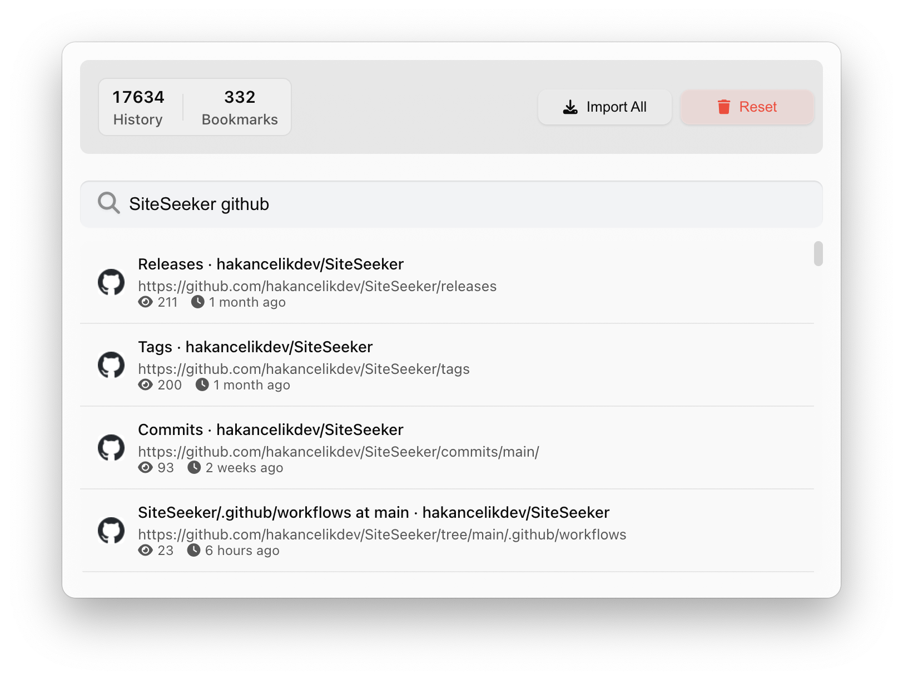

# SiteSeeker 🚀

Your intelligent browser history and bookmark search companion for macOS. Find anything in your browsing history instantly with a beautiful, native interface.



## 🌐 Website

Visit our beautiful landing page: **[SiteSeeker Website](https://siteseeker.hakancelik.dev/)**

The website includes:
- ✨ Interactive demo and feature showcase
- 📱 Responsive design for all devices
- 🎯 Clear installation and usage instructions
- 🚀 Download links and system requirements
- 👨‍💻 Developer information and mission/vision
- ♿ Full accessibility support
- 🔒 Enhanced security features
- 🔍 SEO optimized

## ✨ Key Features


### 🔍 Smart Search
- **Lightning Fast**: Results in milliseconds
- **Intelligent Ranking**: Bookmarks and frequently visited pages prioritized
- **Partial Matching**: Find what you need even with partial words
- **Bookmark Search**: Quick access with 'b:' prefix
- **Typo Tolerance**: Find results even with spelling mistakes

### 🎯 Browser Integration
- **Multi-Browser Support**: Chrome and Firefox in one place
- **Real-Time Sync**: Instant history and bookmark updates
- **Smart Import**: Automatic data synchronization
- **Visual Indicators**: Clear bookmark and history distinction

### 💻 Native Experience
- **Global Shortcut**: Quick access with ⌘+⇧+Space
- **Modern Design**: macOS Sonoma style interface
- **Smart Theme System**: Automatically follows system dark/light mode preference
- **Multi-Display**: Support for all your screens
- **Window Management**: Drag-and-drop positioning

### 🔒 Privacy & Performance
- **Local-First**: All data stays on your computer
- **Resource Efficient**: Minimal system impact
- **Secure Access**: macOS sandbox compliance
- **Fast Database**: Optimized SQLite integration

### 🎨 Smart Theme System
- **System Integration**: Automatically detects and follows macOS theme preference
- **Dark Mode**: Perfect for low-light environments and reduced eye strain
- **Light Mode**: Clean and bright interface for daytime use
- **Real-Time Switching**: Instantly adapts when you change system theme
- **Optimized Colors**: Carefully crafted color schemes for both themes

## 🚀 Quick Start

### Installation

1. **Download** from the [Mac App Store](https://apps.apple.com/app/siteseeker/id1234567890) (Coming Soon)
2. **Install** directly from the App Store
3. **Launch** SiteSeeker from Applications
4. **Start Searching** with ⌘+⇧+Space!

### System Requirements

- **macOS**: 10.15 (Catalina) or later
- **RAM**: 4GB minimum
- **Storage**: 50MB free space
- **Architecture**: Universal binary (Intel & Apple Silicon)

### Auto Updates

SiteSeeker keeps itself up-to-date automatically:
- Background update checks
- Silent downloads
- Seamless installation
- Update notifications

## 🛠 Website Development

This repository contains the documentation website for SiteSeeker, built with web technologies and deployed via GitHub Pages.

### Prerequisites

- A modern web browser
- Basic knowledge of HTML, CSS, and JavaScript
- Git for version control

### Getting Started

1. **Clone the repository**
   ```bash
   git clone https://github.com/hakancelikdev/SiteSeeker.git
   cd SiteSeeker
   ```

2. **Navigate to the docs folder**
   ```bash
   cd docs
   ```

3. **Start local development server**
   ```bash
   python3 -m http.server 8080
   # or
   npx serve .
   ```

4. **Open in browser**
   Visit `http://localhost:8080` to see the website

### Project Structure

```
SiteSeeker/
├── docs/                  # Website files (GitHub Pages)
│   ├── index.html         # Main website page
│   ├── styles.css         # Website styles
│   ├── script.js          # Website JavaScript
│   ├── assets/            # Website images and assets
│   │   ├── logo.png       # SiteSeeker logo
│   │   ├── favicon.png    # Site favicon
│   │   ├── hero-app.png   # Main app screenshot
│   │   ├── og-image.png   # Social media image
│   │   └── *.png          # Other step images
│   ├── sitemap.xml        # SEO sitemap
│   ├── robots.txt         # Search engine directives
│   ├── _headers           # Security headers
│   ├── _config.yml        # GitHub Pages configuration
│   └── README.md          # Website documentation
├── .github/              # GitHub workflows and templates
│   └── workflows/        # CI/CD workflows
│       ├── deploy.yml    # GitHub Pages deployment
│       └── lint.yml      # Code linting
├── README.md             # Project documentation
├── CONTRIBUTING.md       # Contribution guidelines
├── CHANGELOG.md          # Version history
└── LICENSE              # Project license
```

### Available Scripts

```bash
# Local development
python3 -m http.server 8080  # Start local server
npx serve docs/              # Alternative local server

# GitHub Pages deployment
# Automatically deployed via GitHub Actions
# when changes are pushed to main branch
```

## 🌟 Website Features

### Modern Web Standards
- **Responsive Design**: Works perfectly on all devices
- **Progressive Web App**: Installable and offline-capable
- **Accessibility**: WCAG 2.1 AA compliant
- **Performance**: Optimized for Core Web Vitals

### SEO & Marketing
- **Search Engine Optimized**: Comprehensive SEO implementation
- **Social Media Ready**: Open Graph and Twitter Card support
- **Structured Data**: Rich snippets for search results
- **Analytics Ready**: Prepared for tracking and analytics

### Security & Privacy
- **Security Headers**: Comprehensive security protection
- **Content Security Policy**: XSS and injection protection
- **HTTPS Enforcement**: Secure connections only
- **Privacy Respecting**: No tracking or data collection

## 🤝 Community & Support

### Getting Help
- [Twitter Updates](https://x.com/hakancelikdev) - Follow for updates and announcements
- [Contact Developer](https://x.com/hakancelikdev) - Direct support and feedback

### Development Guidelines
- Follow the existing code style
- Update documentation as needed
- Ensure accessibility compliance
- Test on multiple devices
- Optimize for performance

## 📊 Project Status

- **Current Version**: v1.2.6
- **Status**: Active Development
- **Platform**: macOS 10.15+
- **Architecture**: Universal Binary (Intel & Apple Silicon)

## 🗺️ Roadmap

### Upcoming Features
- [ ] Safari browser support
- [ ] Advanced search filters
- [ ] Search history and favorites
- [ ] Custom keyboard shortcuts
- [ ] Plugin system for extensions

### Website Improvements
- [ ] Interactive demo
- [ ] User testimonials
- [ ] Performance dashboard
- [ ] Multi-language support
- [ ] Dark mode toggle

## 👨‍💻 Developer

**Hakan Çelik** - Full-stack developer passionate about creating useful tools for macOS users.

- [Twitter](https://x.com/hakancelikdev)
- [LinkedIn](https://linkedin.com/in/hakancelikdev)
- [GitHub](https://github.com/hakancelikdev)
- [Website](https://hakancelik.dev)

## 🙏 Acknowledgments

- Inspired by Alfred and Spotlight
- Built with modern web technologies
- Designed for the macOS community
